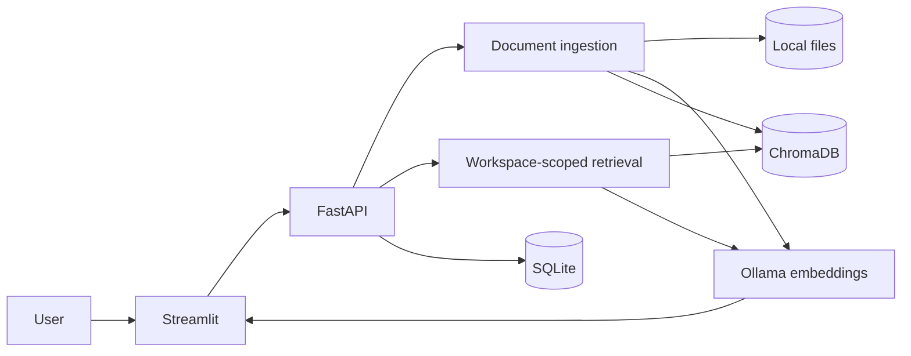

# PrivateRAG AI

[](https://github.com/itstofi/PrivateRAG-AI/actions/workflows/ci.yml)
[](https://www.python.org/)
[](LICENSE)

PrivateRAG AI is a local document assistant built around Ollama. It indexes PDF, DOCX, TXT,
and Markdown files, retrieves the relevant passages, and answers with citations you can inspect.
Documents, embeddings, conversations, and model requests stay on the machine running the app.

I built this project to explore what a practical RAG system needs beyond a basic
“embed and prompt” demo: workspace isolation, safe ingestion, grounded citations, conflicting
evidence, model changes, migrations, and a UI that still explains what is happening when a
local service is unavailable.

## What it does

- Organizes documents and conversations into isolated workspaces
- Validates and indexes PDF, DOCX, TXT, and Markdown files
- Uses Ollama for both local embeddings and local answer generation
- Streams answers with expandable source excerpts
- Shows semantic similarity without presenting it as answer confidence
- Detects likely conflicts between retrieved sources
- Treats instructions found inside documents as untrusted text
- Stores metadata and chat history in SQLite
- Supports chat history, rename, delete, resume, and Markdown export
- Exposes the application through both FastAPI and Streamlit

There is no cloud-model fallback and the app does not download models automatically.

## How it works



At query time, the API normalizes the question, preserves context for genuine follow-ups,
searches only inside the selected workspace, removes overlapping results, and fits the best
evidence into a fixed context budget. The model receives numbered source blocks and the answer
is returned with citations aligned to those blocks.

More detail is available in [ARCHITECTURE.md](ARCHITECTURE.md).

## Stack

- Python 3.11–3.14
- FastAPI, Pydantic, SQLAlchemy, and Alembic
- Streamlit
- Ollama
- ChromaDB
- PyMuPDF and python-docx
- pytest, Ruff, mypy, and GitHub Actions

## Quick start

### 1. Install the prerequisites

You need:

- Python 3.11 or newer
- [uv](https://docs.astral.sh/uv/)
- [Ollama](https://ollama.com/)
- `make`

Pull a chat model and the embedding model:

```bash
ollama pull llama3.2:3b
ollama pull nomic-embed-text
```

Ollama usually starts automatically after installation. If it does not:

```bash
ollama serve
```

### 2. Set up the application

```bash
git clone https://github.com/itstofi/PrivateRAG-AI.git
cd PrivateRAG-AI
cp .env.example .env
make install
make setup
```

`make setup` creates the local data directories and upgrades the SQLite schema with Alembic.

### 3. Run it

Start the API:

```bash
make run-api
```

In a second terminal, start the UI:

```bash
make run-ui
```

Then open:

- Streamlit UI: <http://localhost:8501>
- OpenAPI docs: <http://localhost:8000/docs>
- Health endpoint: <http://localhost:8000/health>

Create a workspace, upload a document, wait for it to be indexed, and ask a question. The
fictional files in [`sample_documents/`](sample_documents/) are useful for a first run.

## Docker

Docker Compose runs the API and UI while keeping Ollama on the host:

```bash
cp .env.example .env
make docker-up
```

For the container setup, set:

```env
OLLAMA_BASE_URL=http://host.docker.internal:11434
```

The Compose file maps `host.docker.internal` on Linux as well as macOS and Windows. Application
data is stored in the `private_rag_data` volume.

## Configuration

The main settings are:

| Variable | Default | Purpose |
| --- | --- | --- |
| `DATA_DIR` | `./data` | Root directory for local runtime data |
| `DATABASE_URL` | `sqlite:///./data/database/private_rag.db` | Metadata and chat database |
| `OLLAMA_BASE_URL` | `http://localhost:11434` | Ollama endpoint |
| `OLLAMA_CHAT_MODEL` | `llama3.2:3b` | Default chat model |
| `OLLAMA_EMBEDDING_MODEL` | `nomic-embed-text` | Embedding model |
| `MAX_UPLOAD_SIZE_MB` | `25` | Upload size limit |
| `CHUNK_SIZE` | `900` | Approximate chunk size in characters |
| `CHUNK_OVERLAP` | `150` | Overlap between adjacent chunks |
| `TOP_K` | `5` | Maximum retrieved results |
| `SIMILARITY_THRESHOLD` | `0.25` | Minimum cosine similarity |
| `USE_MMR` | `false` | Enable result diversification |
| `MAX_CONTEXT_CHARS` | `12000` | Maximum retrieved context |
| `TEMPERATURE` | `0.1` | Generation randomness |

Settings changed in the UI affect the current API process. Change `.env` to keep them after a
restart. Documents must be reindexed after changing the embedding model or chunking settings.

## API

FastAPI provides:

- health, runtime status, model, and settings endpoints
- workspace CRUD
- document upload, list, reindex, and delete
- chat CRUD and Markdown export
- regular and newline-delimited streaming query endpoints

The generated OpenAPI documentation at `/docs` is the easiest way to inspect and try the API.

## Quality checks

```bash
make lint
make typecheck
make test
make evaluate
```

The normal test suite mocks Ollama and does not download a model or call a cloud service. The
offline RAG evaluation covers source retrieval, workspace isolation, citation accuracy,
insufficient-context refusal, conflicting evidence, and prompt-injection-like document text.

To include the opt-in test against a running local Ollama installation:

```bash
RUN_OLLAMA_TESTS=1 uv run pytest -m ollama
```

## Project layout

```text
app/              API, services, ingestion, retrieval, and storage
frontend/         Streamlit interface and reusable UI components
tests/            Unit and integration tests
scripts/          Setup, diagnostics, samples, evaluation, and reset utilities
evaluation/       Deterministic RAG cases and the latest results
migrations/       Alembic database migrations
sample_documents/ Fictional files for demos and testing
data/             Ignored local uploads, SQLite, and Chroma data
```

## Design decisions

- **FastAPI is the boundary.** Streamlit is a client rather than a second implementation of
  the business logic.
- **Workspace filters are enforced twice.** Metadata queries and vector retrieval both scope
  results to the selected workspace.
- **Embedding collections are model-specific.** Switching models cannot silently mix vectors
  with incompatible dimensions.
- **Citations follow the prompt.** Only chunks that fit into the final prompt can appear as
  sources.
- **Retrieved text is data, not instruction.** Source boundaries explicitly warn the model
  against following directions found inside a document.
- **Deletion stays inside configured roots.** Uploaded filenames are generated and file removal
  paths are checked before use.

The security assumptions and remaining risks are documented in [SECURITY.md](SECURITY.md).

## Limitations

- Designed for one trusted user; there is no authentication layer
- Scanned PDFs need OCR before upload
- DOCX pagination is not available
- Retrieval quality still depends on the chosen embedding model and source material
- Ollama owns GPU selection and hardware acceleration

Possible next steps include hybrid keyword/vector retrieval, optional OCR, local reranking, and
encrypted workspace export.

## License

Released under the [MIT License](LICENSE).

Built and maintained by [itstofi](https://github.com/itstofi).
